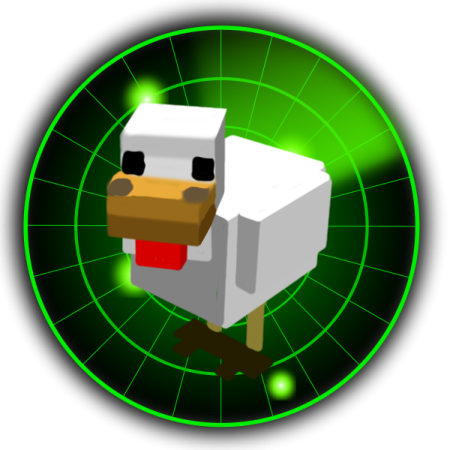
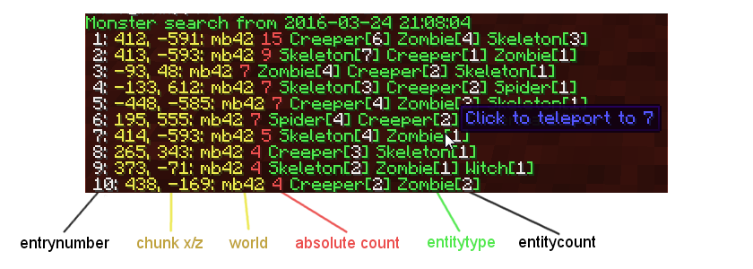

#  EntityDetection

EntityDetection is a Paper plugin with which you can quickly find chunks with a large amount of Monsters, Animals or even Tile Entities like Hoppers in it.

Very useful if you want to find XP-Farms that accumulate a large amount of mobs or that one infinite chicken or villager breeder that brings your server to its knees!

## Installation

1. Download the latest version of the EntityDetection plugin:
   1. [Modrinth](https://modrinth.com/mod/entitydetection)
   2. [Hangar](https://hangar.papermc.io/plugins/EntityDetection)
   3. [Dev Builds](https://ci.minebench.de/job/EntityDetection/)
2. Place the downloaded `.jar` file into the `plugins` directory of your Paper server.
3. Restart the server to enable the plugin.

## Dependencies

This plugin does not require any other plugin to run, but it requires [Paper](https://papermc.io/) to be used as the server software and can optionally integrate with [WorldGuard](https://worldguard.enginehub.org/) for region-based entity detection.

## Usage

### Commands

- `/detect search [monster|passive|misc|block|tile|entity|all|<type>]`
    - The main plugin command. Start a search for chunks with lots of entities in it. Without any type it searches for Monsters but you can also search for a specific type of entities (take a look at the different types below) or for single [entity types](https://jd.papermc.io/paper/1.21.4/org/bukkit/entity/EntityType.html). With version 1.1 you can also search for Hopper and other blockstates! You can also combine different types by just inputting them after each other separated by a space. When the search is finished you will get a list for all chunks sorted by their entity count.

- `/detect search --regions [<type>]`
    - List results based on WorldGuard regions instead of chunks

- `/detect list [<page> [monster|passive|misc|block|tile|all|<type>]]`
    - List more pages of a previous search result. You can specify a type to see the last search of a specific type.

- `/detect stop`
    - Stops the currently running search.

- `/detect tp <#result>`
    - Teleport to a specific entry number from a search. (You can also directly click on the entry line to teleport to it!)

### Search Types:
#### Monster
> All the monsters and slimes

#### Passive
 All the animals, NPCs and golems as well as ambient and water mobs

#### Misc
 Everything that is not a real mob: fireworks, boats, minecarts, projectiles, dropped items, ender signals and lightning strikes.

##### Block (More like pseudo-block but that's too long)
 Entities that behave more like blocks than entities: armor stands, ender crystals, paintings, item frames and falling blocks.

#### Entity
 Search for all the entities, no matter what type they are

#### Tile
 Search for all tile entities, no matter what type they are

#### All
 Search for everything entities and tile entities/blockstates, no matter what type they are

#### <[BlockState](https://jd.papermc.io/paper/1.21.4/org/bukkit/block/BlockState.html)/[Material](https://jd.papermc.io/paper/1.21.4/org/bukkit/Material.html)>
 The categories aren't enough? Then you can search for specific tile entities directly! This is done by either inputting the class name of their block state (which is case sensitive) or the Material name!

#### <[EntityType](https://jd.papermc.io/paper/1.21.4/org/bukkit/entity/EntityType.html)>
 You can also search for the specific Bukkit entity type! Every single one is supported and can be combined with the other search types.

If you have ideas how one of the types could be improved or for a new one just respond to the discussion thread or directly submit a pull request for a modification of the [SearchType enum](https://github.com/minebench/entitydetection/blob/master/src/main/java/de/themoep/entitydetection/searcher/searchtype.java)!

### Examples

- To search for all monsters: `/detect search monster`
- To list the results of the last search: `/detect list`
- To teleport to the first result: `/detect tp 1`

### Permissions

- `entitydetection.command`
    - Allows the player to use the `/detect` command.
    - Default: `op`
- `entitydetection.command.search`
    - Allows the player to use the `/detect search` command.
    - Default: `op`
- `entitydetection.command.list`
    - Allows the player to use the `/detect list` command.
    - Default: `op`
- `entitydetection.command.stop`
    - Allows the player to use the `/detect stop` command.
    - Default: `op`
- `entitydetection.command.tp`
    - Allows the player to use the `/detect tp` command.
    - Default: `op`

## Configuration

The plugin supports multiple languages. You can set the default language via the `de.themoep.entitydetection.default-language` system property and create your own language files in the `languages` folder. The default language is English (`en`).

## Contributing

Contributions are welcome! If you find any bugs or have feature requests, please open an issue on the GitHub repository.

## License

This project is licensed under the Mozilla Public License version 2.0. See the [LICENSE](LICENSE) file for details.